# GUNS_process
整理一下如何上传前后端的流程

## Requirement
1. Java Jdk 1.8
2. Nodejs 18+
3. maven 3.6+

## Dependency
1. 打开`guns-8.1.2-roses-kernel`文件夹，执行`mvn clean install`命令，将核心包安装到本地仓库
2. 打开`guns-8.1.2-enterprise-plugins`文件夹，执行`mvn clean install`命令，将企业版插件核心包安装到本地仓库

## 启动后端

需要更改的`settings`:
1. guns version 1.8
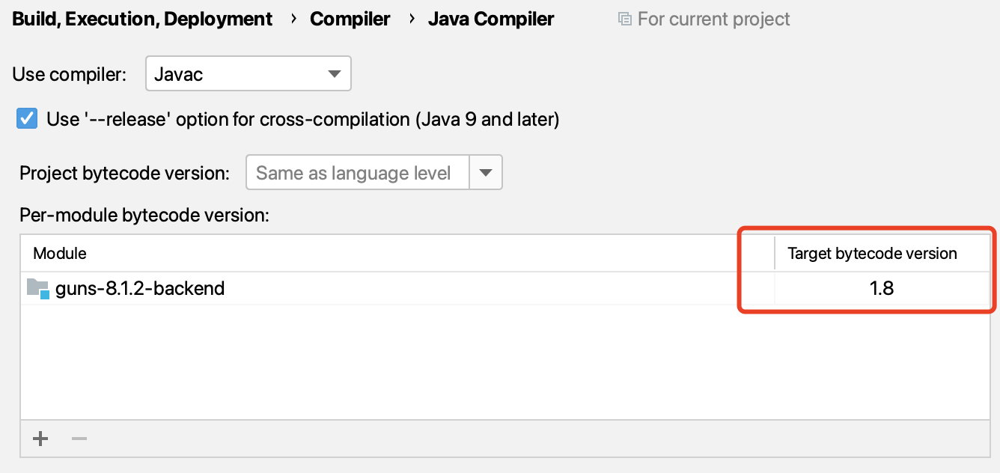
2. 修改 maven 配置
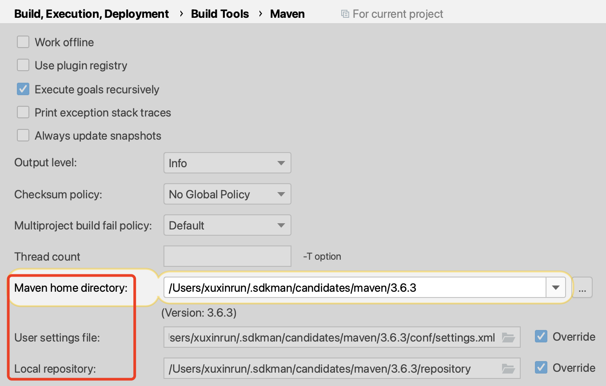
3. 设置 `model-platform-yx/guns-8.1.2-backend/src/main/java` 为 Source root, (右键 -> Mark Directory as -> Sources Root)
4. 设置 `model-platform-yx/guns-8.1.2-backend/src/main/resources` 为 Resource root, (右键 -> Mark Directory as -> Resource Root)
5. 打开guns-8.1.2-backend启动后端即可

## 启动前端

打开`model-platform-yx/guns-8.1.2-front`

执行`npm run dev`命令，即可启动项目

# 在 SQL 中生成表

连接服务器上的数据库

把建表语句输入`新建查询`中，点击运行

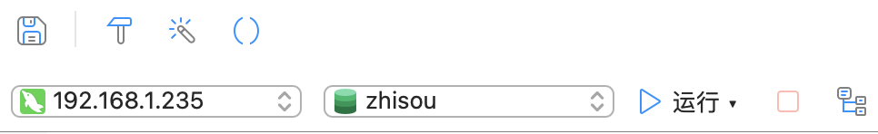

推荐先在SQL中生成表，可以找到一些报错

# 如何建表

- 这一部分可以同时参考PDF 《代码生成及菜单配置》

    https://gunsdevops.com/login 注册并登陆

## 在GUNS生成表

-> 0 [Button] `开始使用`

-> 1 [左侧边栏] `应用设计`

-> 2 `数据表`

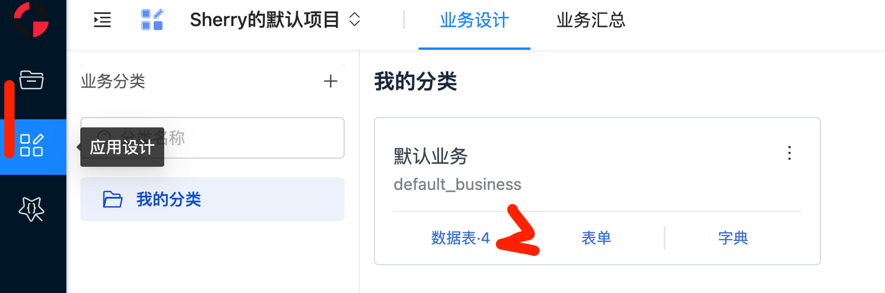

-> 3 [右侧上方] `导入SQL`

-> 4 粘贴自己的SQL代码
- 把 float 改成 decimal(x,y)

    x, y需要根据需要自己设置, x为一共有几位数，y为小数点后有几位数

- 把 boolean 改成 char(1)

-> 5 点击`确定`

-> 不断重复3,4,5 直到这个子模块的表全部导入

## 生成后端代码

-> 1 [左侧边栏] `应用生成`

-> 2 [上面边栏] `代码生成`

-> 3 `后端代码`

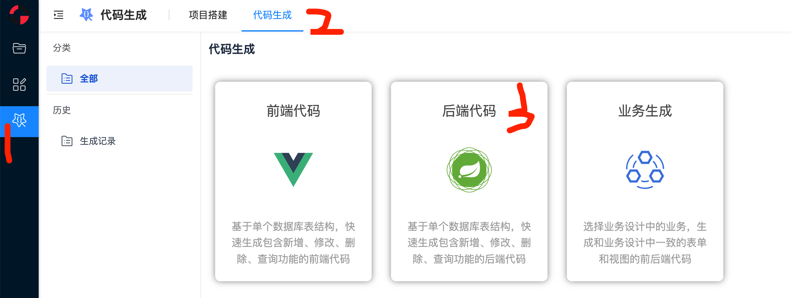

开始建立后端代码，红框部分请根据自己的模块进行修改

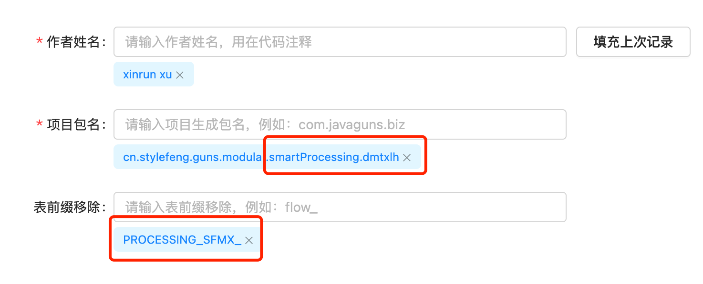

-> 4 将我的分类中所有输入这个子模块的表导入进去 (一般是最后几个)

-> 5 点击`生成代码`

-> 6 点击`打包下载`

## 生成前端代码

-> 1 [左侧边栏] `应用生成`

-> 2 [上面边栏] `代码生成`

-> 3 `前端代码`

开始建立前端代码，红框部分请根据自己的模块进行修改

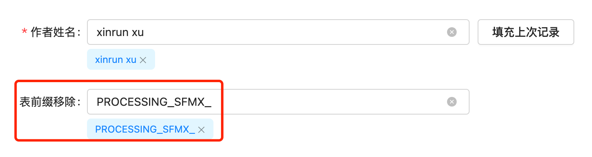

-> 4 将我的分类中所有输入这个子模块的表导入进去 (一般是最后几个)

-> 5 点击`生成代码`

-> 6 点击`打包下载`

# 如何把GUNS生成的代码部署到当前代码中


## 后端代码部署

1. 将下载的后端代码解压，将解压后的文件夹拷贝到`guns-8.1.2-backend/src/main/java/cn/stylefeng/guns/modular`相应的模块中
2. 修改所有 `controller` 中的导入包
   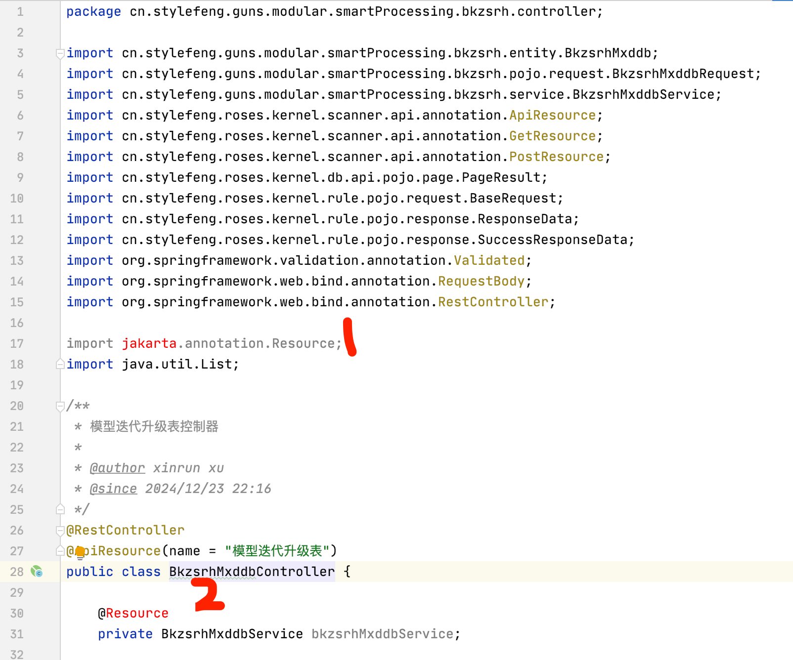
    a. 删除红色的行

    b. 在 @Resource 上 按快捷键 `Alt + Enter` （mac 上是 `Option + Enter`） 选择 `Add module dependency`，选择当前模块

    ```java
    import javax.annotation.Resource;
    ```

    c. 在所有的 `...Controller` 中 执行 a,b 步骤 (有几个表就有几个 `...Controller` )
3. 修改所有 `pojo.request` 中的导入包
   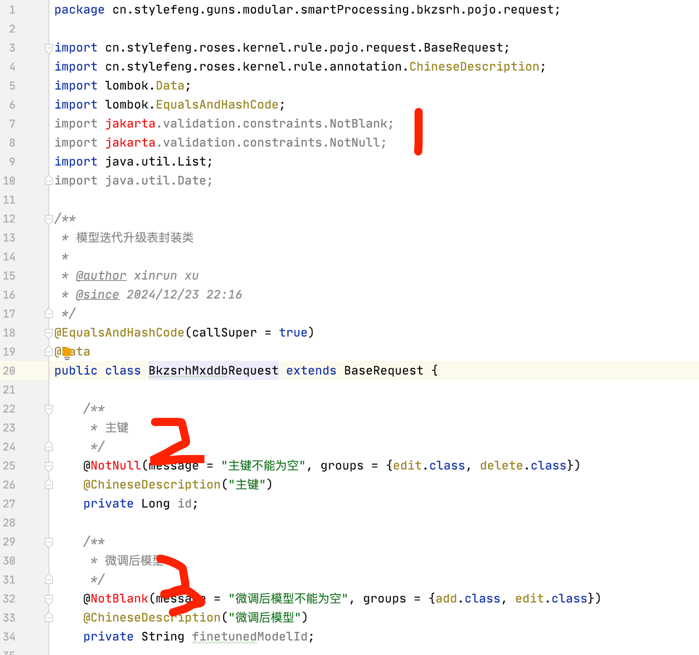
    a. 删除红色的俩行

    b. 在 `@NotNull` 上 按快捷键 `Alt + Enter` （mac 上是 `Option + Enter`） 选择 `javax` 的 `@NotNull`

    c. 在 `@NotBlank` 上 按快捷键 `Alt + Enter` （mac 上是 `Option + Enter`） 选择 `javax` 的 `@NotBlank`

    ```java
    import javax.validation.constraints.NotBlank;
    import javax.validation.constraints.NotNull;
    ```

    d. 在 所有的 `...Request` 中 执行 a,b,c 步骤 (有几个表就有几个 `...Request` )
4. 修改所有 `pojo.response` 中的导入包
    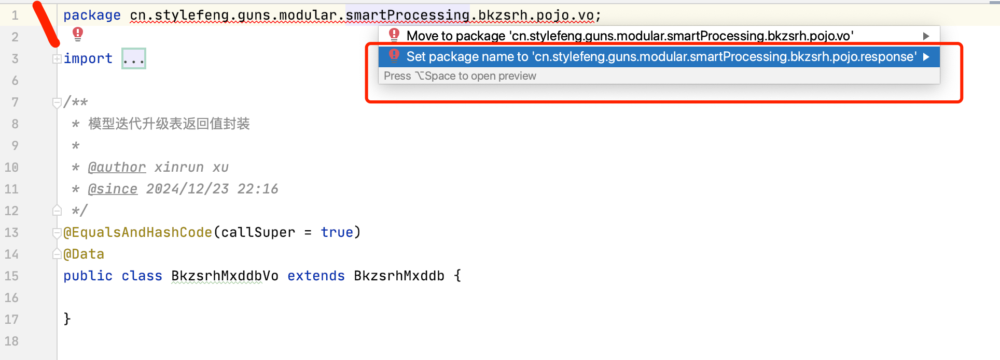
    a. 在第一行 上 按快捷键 `Alt + Enter` （mac 上是 `Option + Enter`） 选择 上图中红框的包

    b. 在 所有的 `...Vo` 中 执行 a 步骤 (有几个表就有几个 `...Vo` )

## 前端代码部署

1. 在 `guns-8.1.2-front/src/views/` 自己的模块下面 **建立 一个当前子模块的文件夹** （与生成后端代码的的项目包名对应），将下载的前端代码解压，将解压后的文件夹拷贝到这个文件夹中

# 建立菜单

- 这一部分可以同时参考PDF 《代码生成及菜单配置》

## 建立一级目录

-> 1 点击`应用`

-> 2 点击`后台管理`

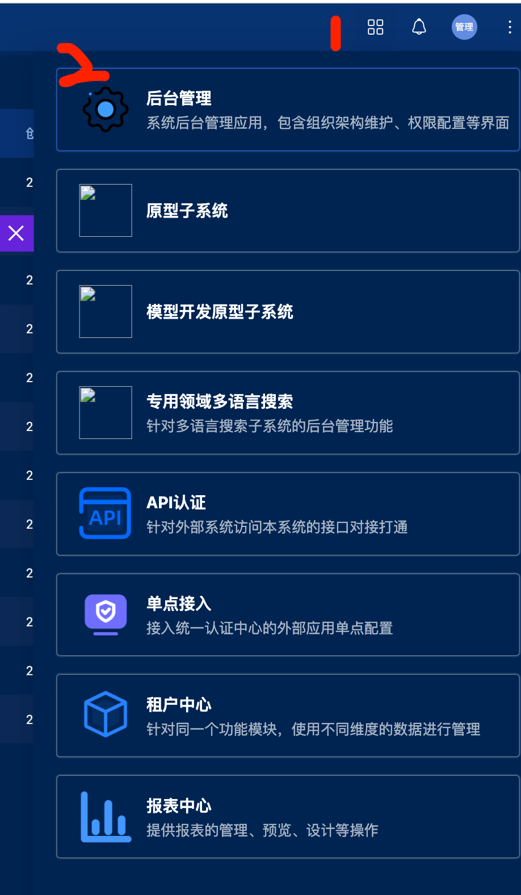

-> 3 点击`应用`

-> 4 点击`新建`

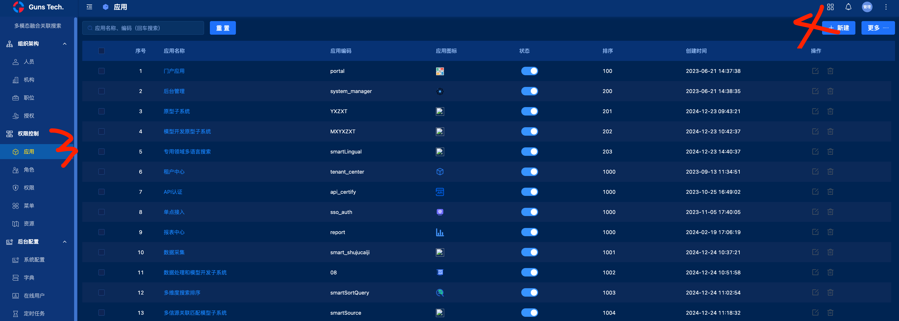

-> 5 根据自己子系统输入相应的信息

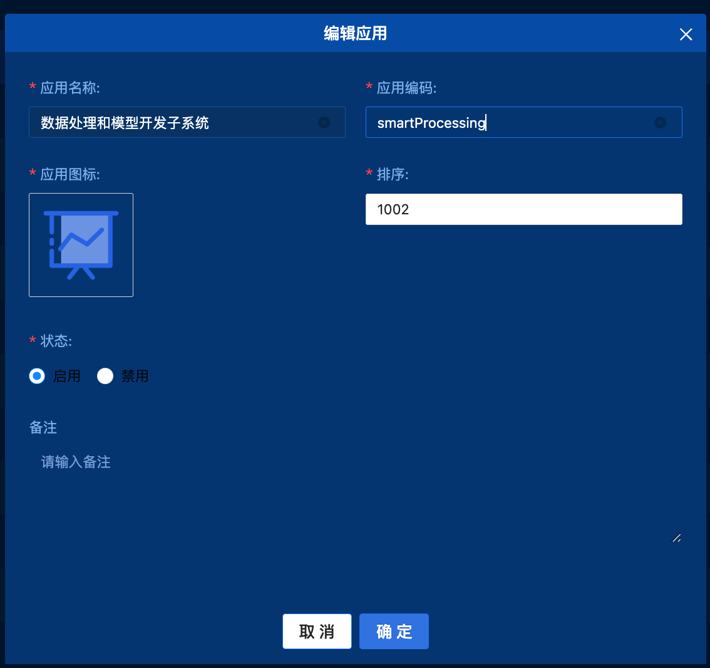

## 建立二级目录

-> 1 点击`菜单`

-> 2 在最右边滑动到自己的子系统

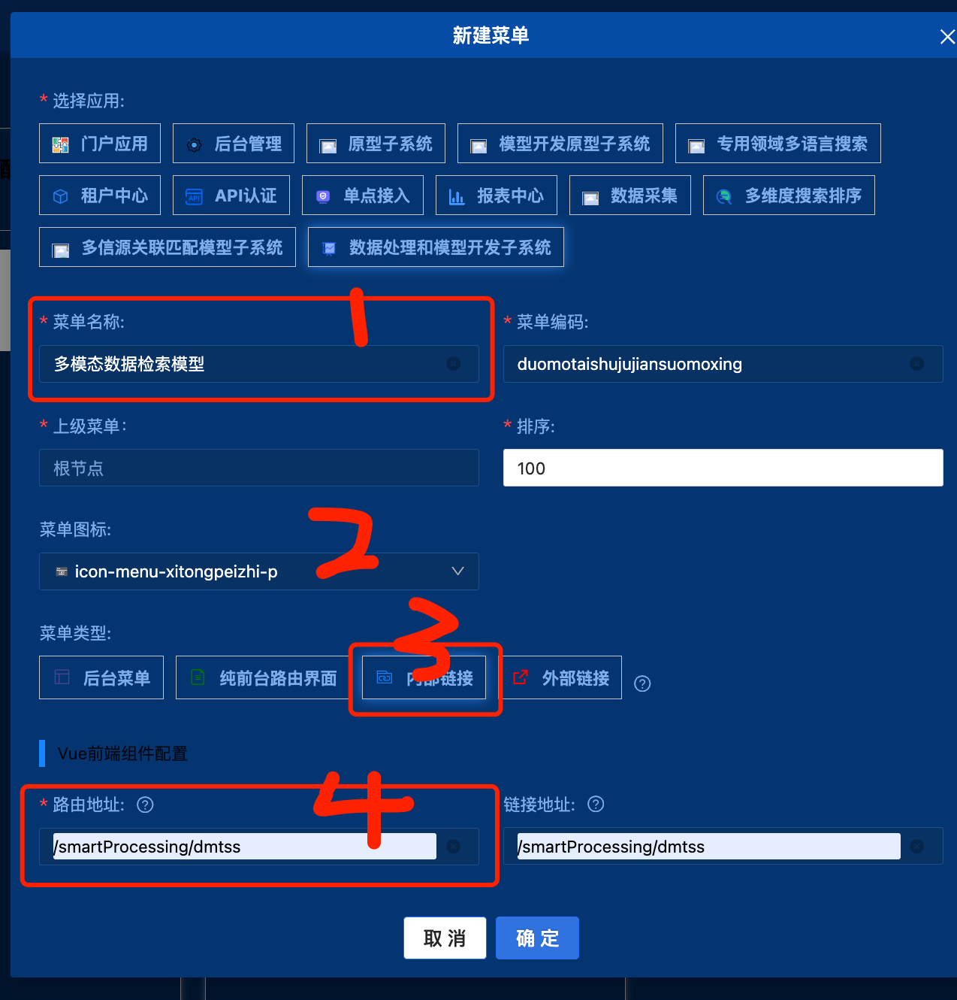

-> 3 按照图示步骤修改为自己的二级目录信息

## 建立三级目录

-> 1 点击相应二级目录的`新建`

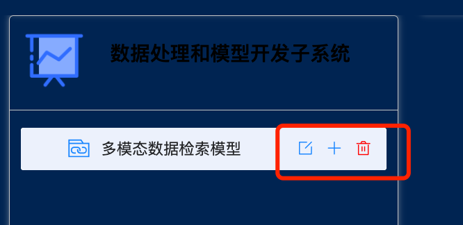

-> 2 按照图示步骤修改为自己的三级目录信息

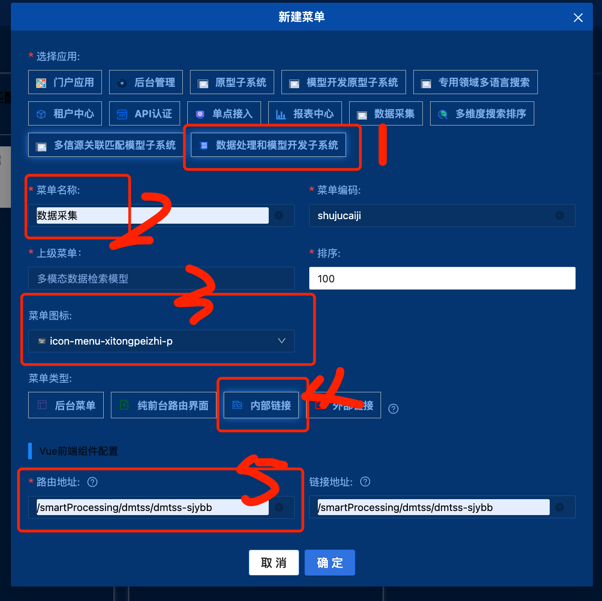

路由地址为前端代码中的vue地址：

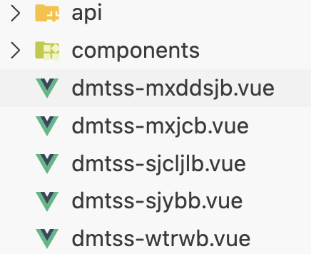

添加完第一个三级目录后，请重启前后端代码，确保菜单能够正常显示后，再继续添加余下三级目录