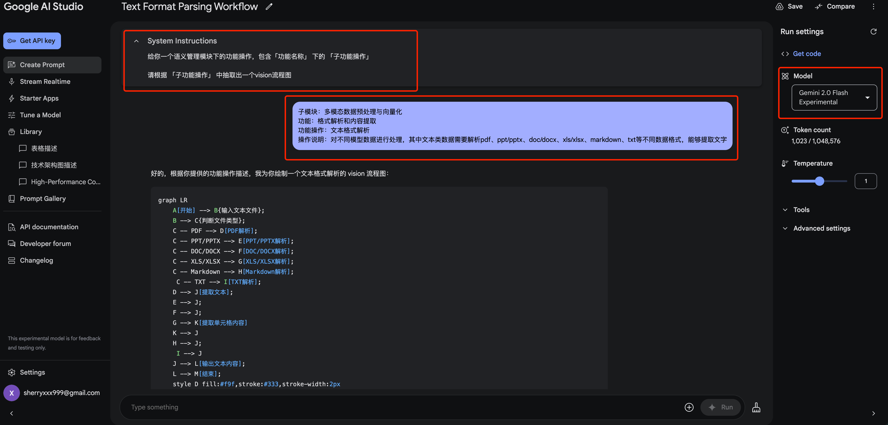
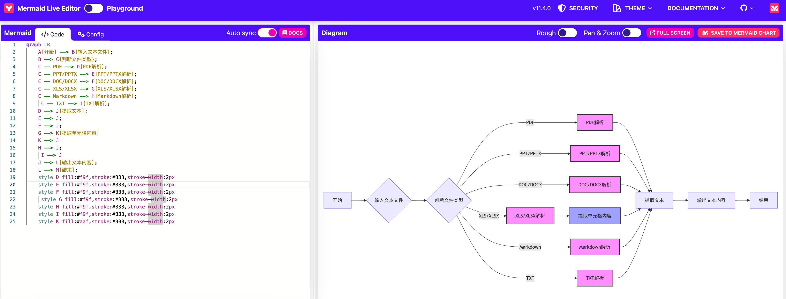

# 如何使用谷歌大模型 Gemini 生成 visio 流程图

[谷歌大模型 Gemini 官网](https://aistudio.google.com/app/prompts/new_chat)



`Prompt`:

```
给你一个语义管理模块下的功能操作，包含「功能名称」 下的 「子功能操作」
请根据 「子功能操作」 中抽取出一个visio流程图
```

```
子模块：XXX
功能：XXX
功能操作：XXX
操作说明：XXX
```

将生成的代码复制到：[这个网页](https://mermaid.live/edit#pako:eNpVkEFrhEAMhf9KyKkF_QMeCl1t97Klhe6p6iFodIZ1JsM4sizqf--4ttDmlPC-9whvxkZaxgy7Qa6NIh_gXFQW4jyXufJ6DIbGGtL0aTlyACOWbwscHo4CoxLntO0fd_6wQZDPpw1jCErby7pL-d3_bnmBojyRC-Lqv8r5Kgu8lPpDxfj_ivIcXa9lR1lHaUMecvI1JmjYG9JtfH3eDBUGxYYrzOLackfTECqs7BpRmoJ83myDWfATJ-hl6hXGvGGM1-RaClxo6j2ZX4RbHcS_7d3cK0rQkf0SMT_G9RsZb2ap)


